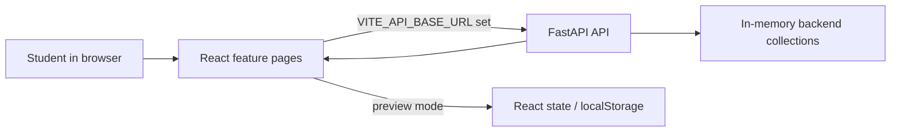

# StudyHive
## Find the right people to study, build, and learn with at HITSZ.

StudyHive is a student collaboration platform for the Harbin Institute of Technology, Shenzhen. It brings study-partner discovery, study groups, project recruitment, senior guidance, requests, messaging, notifications, and profiles into one place. The goal is practical: reduce the effort of finding someone with the right course, time, skills, or experience, then give students a clear way to connect.

## Main features

- **Study Buddy** — search listings by course and optional major, date, time range, and location; publish listings and send study requests through the API, or use the fictional local preview.
- **Study Groups** — search rooms, create rooms with capacity, view members, request a seat, refresh details, and cancel rooms you created.
- **Projects** — filter projects by text, type, skill, and open roles; publish projects, request roles, and cancel projects you own.
- **Ask a Senior** — search senior profiles, publish a senior profile, change availability, and send questions. Connected profiles and answers come from the API.
- **Requests and notifications** — view pending inbox items and respond to supported buddy and group requests. Local read state is held in page state.
- **Messages** — use personal or group chats, search and filter conversations, send with Enter, keep new lines with Shift+Enter, attach files, create chats, and view details. Preview chats persist in browser local storage.
- **Authentication and profile** — register and log in with a student ID, edit profile text and picture, and choose up to three earned badges. The frontend keeps the returned user ID in memory; the backend branch does not issue browser sessions or tokens.
- **Home and resources** — navigate to every feature and open the HITSZCS Notes & Lectures repository.

## How StudyHive works



The frontend chooses connected or preview behavior from `VITE_API_BASE_URL`. The supplied backend stores data in Python dictionaries, so backend data resets when the process restarts. Preview messages additionally use local storage.

## Tech stack

React 19, TypeScript 5.9, Vite 7, Tailwind CSS 4, Lucide React, FastAPI, Pydantic, Uvicorn, ESLint, and Playwright.

## Repository structure

```text
src/                    # App wiring, shared UI, and feature folders
backend/                # FastAPI application on feature/backend-auth
tests/                  # Playwright UI and API-contract tests
docs/                   # Architecture and engineering decisions
```

## Getting started

Prerequisites: Node.js 22.12+, npm, Python 3.10+, and Chromium for Playwright.

### Frontend preview

```sh
npm install
npm run dev
```

Open the Vite URL, normally `http://127.0.0.1:5173`. Without an API URL, supported pages use local preview data.

### Backend connection

The FastAPI implementation is on `feature/backend-auth`:

```sh
git worktree add ../StudyHive-backend feature/backend-auth
cd ../StudyHive-backend
python -m venv .venv
# Windows PowerShell
.\.venv\Scripts\Activate.ps1
pip install -r backend/requirements.txt
python -m uvicorn backend.main:app --reload --host 127.0.0.1 --port 8000
```

In the frontend worktree, copy `.env.example` to `.env.local` and set `VITE_API_BASE_URL=http://127.0.0.1:8000`, then restart Vite. `VITE_*` values are public browser configuration.

### Demo account

To explore authenticated features such as notifications, requests, profile, and Messages, you can register or log in with this example account when using a fresh backend:

```text
Full name:  Alice Zhang
Student ID: 22S000001
Password:   demo1234
Email:      alice@hitsz.edu.cn
Major:      Computer Science
Degree:     bachelor
Year:       3
```

The account can be used for the demo, but students may register and use their own account instead. Because the prototype backend stores data in memory, demo requests, conversations, and notifications reset when the backend restarts.

## Checks and tests

```sh
npm run typecheck
npm run lint
npm run build
npm run test:ui
```

Playwright runs at 1920×1080 and 1366×768. API-contract tests need a running backend and do not replace backend authorization or deployment checks.

## Desktop targets

The primary acceptance viewports are **1920×1080** and **1366×768** at 100% browser zoom. Narrow-screen rules remain available, but mobile is not the primary acceptance target.

## Contributors

| Area | Owner |
| --- | --- |
| Product, UI, and frontend | Graciella Callista Edwardson |
| Backend, core, and data | Emil Aliyev |

## Current status

The frontend implements the main discovery, group, project, senior, request, messaging, notification, authentication, and profile flows, with optional FastAPI connectivity. The backend branch is an in-memory prototype without persistent database storage or browser sessions/tokens, so those concerns remain before production deployment.

## Documentation

- [Architecture](docs/architecture.md)
- [Engineering decisions](docs/decisions.md)
- [Contributing](CONTRIBUTING.md)
- [License](LICENSE)

Screenshots are not currently stored in the repository.
