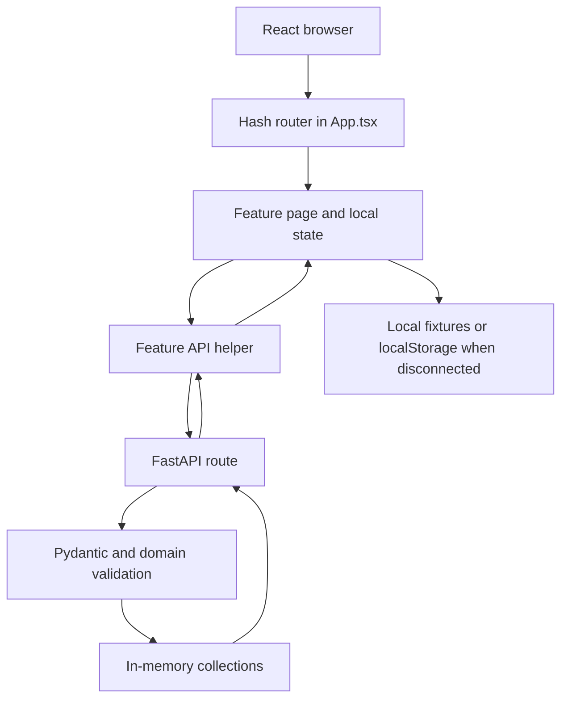

# StudyHive architecture

## Overview

StudyHive is a Vite-served React application with feature-oriented UI modules and an optional FastAPI service. The frontend uses a local preview when `VITE_API_BASE_URL` is blank and connected behavior when it is set. The backend branch (`feature/backend-auth`) keeps users, listings, groups, projects, senior profiles, requests, conversations, and messages in process memory.

## Goals and boundaries

Page state and rendering stay in feature pages, reusable presentation stays in nearby component files, and API/data mapping stays in small feature helpers. Shared layout and controls live in `src/shared`. The backend owns validation, relationships, request status, and response shapes; the browser owns view state, transient drafts, and preview fixtures.

## Repository structure

```text
src/App.tsx, src/main.tsx       routing and application wiring
src/shared/                     layout, controls, artwork, global styles
src/features/<feature>/         page, components, data/API helper, CSS
backend/main.py                 FastAPI routes and in-memory domain state
tests/                          Playwright preview and API-contract tests
```

`App.tsx` maps hash pages to feature pages and supplies the in-memory logged-in user ID. `AuthLayout` serves login and registration; `AppLayout` supplies the sidebar and authenticated-area frame. Feature helpers contain types, fixtures, API calls, and response mapping. `backend/main.py` defines FastAPI routes, Pydantic request models, validation helpers, public-user shaping, and in-memory collections for each domain.

## Responsibilities and data flow



Connected requests send the logged-in user ID explicitly. Responses are mapped to display models before rendering. Fetch failures remain visible errors; connected features do not silently replace failed API data with fictional data. Preview Messages reads and writes a namespaced local-storage value.

## Conceptual models

- **User/profile:** identity, student ID, email, degree, major, grade, description, picture, earned badges, and displayed badges.
- **Study listing/room:** owner, course, date, start/end time, location, notes, and request/member state. Rooms also have a maximum member count including the creator.
- **Project:** owner, summary/description, type, roles with skills, team members, and join requests.
- **Senior question:** senior, asker, topic, question, optional answer, and status.
- **Conversation/message:** personal or group membership, messages with sender and text, and UI-only attachment/pin metadata in preview mode.

## Feature flows

### Authentication and profile

Registration posts student details to `/register`; login posts credentials to `/login` and stores only the returned user ID in React memory. Profile pages load public fields, patch description/picture, load the badge catalogue, and update displayed badges. Reloading clears frontend identity and requires login again.

### Study Buddy

The connected page loads the course catalogue, searches `/study-buddy` with optional filters, publishes listings, and posts requests to a listing. The server validates overlap and ownership; the UI keeps the demo browser separate.

### Study Groups

The page searches `/study-groups`, creates rooms, loads a room and roster, sends seat requests, and deletes rooms owned by the current user. Membership and capacity are decided by the backend.

### Projects

Projects are listed and filtered in the page. Creation posts roles and skills, join requests post the desired role and message, and owners can cancel a project. The API creates project/team relationships and validates request status.

### Ask a Senior

The page loads senior profiles, filters them, publishes or edits the current senior profile, toggles availability, and submits questions. The backend stores questions and exposes asked questions and answer actions.

### Requests, notifications, and messages

Notifications loads the user's request inbox and sends supported accept/decline actions. Messages loads conversations and histories, posts messages, and creates personal/group conversations. Enter sends a draft and Shift+Enter inserts a line break. Preview conversations and attachments are browser-local; connected conversation data comes from the API.

## Configuration, persistence, and testing

`VITE_API_BASE_URL` is the only frontend environment variable. Blank means preview mode; a URL means connected mode and requires a Vite restart. The backend normally runs on `127.0.0.1:8000`; its dictionaries reset on restart. The frontend user ID is memory-only, while preview messages use `localStorage`.

TypeScript/build and ESLint check the frontend. Playwright runs preview and API-contract suites at 1920×1080 and 1366×768. Intercepted API tests verify payloads and UI handling, but do not prove deployment, authorization, or persistence. Backend route/domain tests belong on the backend branch.
